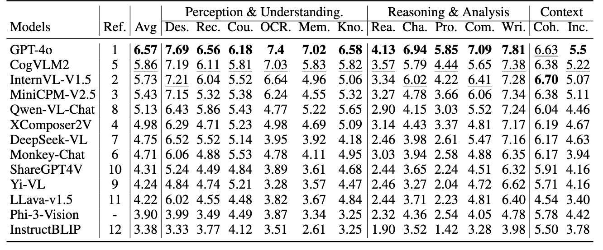

# AlignMMBench: Evaluating Chinese Multimodal Alignment in Large Vision-Language Models

<font size=4><div align='center' > [[🍎 Project Page](https://alignmmbench.github.io/)] [[📖 arXiv Paper](https://arxiv.org/pdf/2406.09295)] [[📊 Dataset](https://huggingface.co/datasets/THUDM/AlignMMBench)]  </div></font>

<p align="center">
    
</p>

---

## 🔥 News

* **`2024.06.14`** 🌟 We released AlignMMBench, a comprehensive alignment benchmark for vision language models!


## 👀 Introduce to AlignMMBench

AlignMMBench a multimodal alignment benchmark that encompasses both single-turn and multi-turn dialogue scenarios. It includes three categories and thirteen capability tasks, with a total of 4,978 question-answer pairs.

### Features

1. **High-Quality Annotations**: Reliable benchmark with meticulous human annotation and multi-stage quality control processes.

2. **Self Critic**: To improve the controllability of alignment evaluation, we introduce the CritiqueVLM, a ChatGLM3-6B based evaluator that has been rule-calibrated and carefully finetuned. With human judgements, its evaluation consistency surpasses that of GPT-4.
   
3. **Diverse Data**: Three categories and thirteen capability tasks, including both single-turn and multi-turn dialogue scenarios.


## 📈 Results

<p align="center">
    
</p>

## License

The use of the dataset and the original videos is governed by the Creative Commons Attribution-NonCommercial-ShareAlike
4.0 International (CC BY-NC-SA 4.0) license, as detailed in the  [LICENSE](./LICENSE).

If you believe that any content in this dataset infringes on your rights, please contact us at **wenmeng.yu@aminer.cn** to request its
removal.

## Citation

If you find our work helpful for your research, please consider citing our work.

```bibtex
@misc{wu2024alignmmbench,
      title={AlignMMBench: Evaluating Chinese Multimodal Alignment in Large Vision-Language Models}, 
      author={Yuhang Wu and Wenmeng Yu and Yean Cheng and Yan Wang and Xiaohan Zhang and Jiazheng Xu and Ming Ding and Yuxiao Dong},
      year={2024},
      eprint={2406.09295},
      archivePrefix={arXiv}
}
```